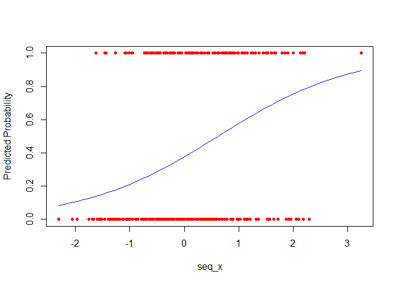
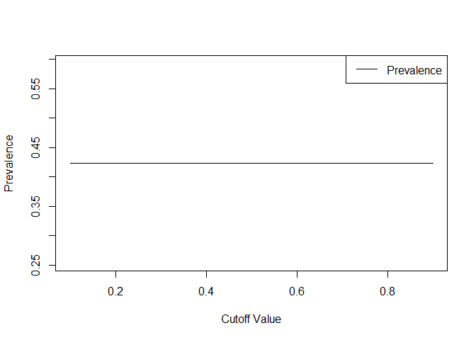
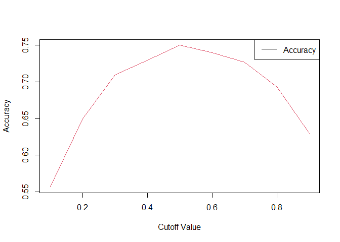
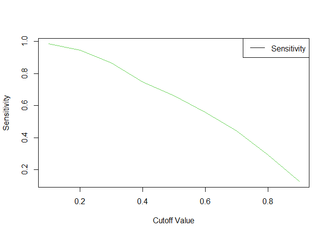
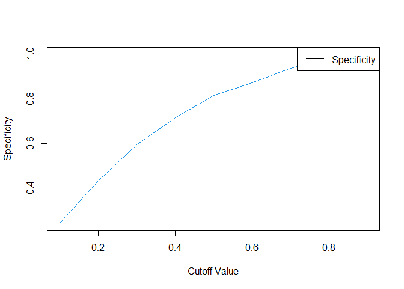
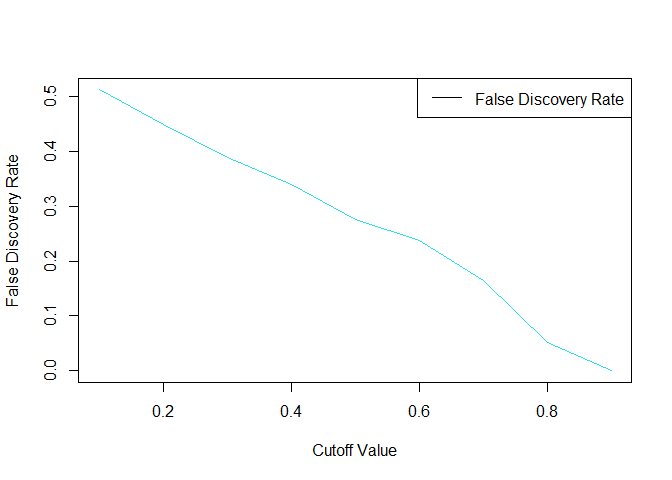
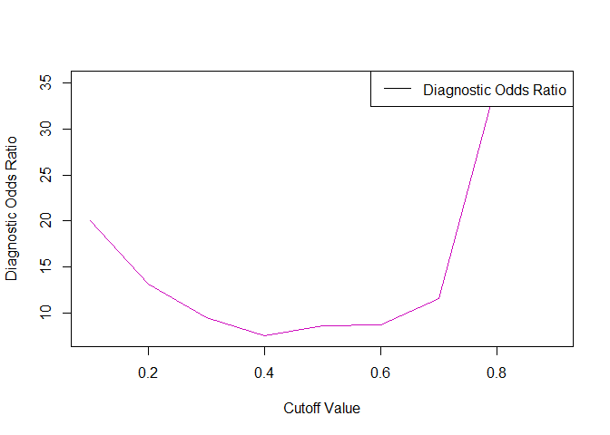

Logistic Regression Package - Group 8
================
Lucas Parvin, Priyadarshni Jitendrabhai Patel, & Felix Satognon
2023-11-30

- ChatGPT was utilized in the creation of this package:
  <https://chat.openai.com/share/cbb8309e-df87-444a-974e-09e9f0cb91ff>
- GitHub Repository Link:
  <https://github.com/R-4-Data-Science/FinalProject_Group8>
- **This package’s website can be viewed here:**
  <https://r-4-data-science.github.io/FinalProject_Group8/>

# **Project 8 Final Project Package**

## **Accessing The Package**

1.  To install the package, you must first install “devtools” if you
    have not already: `install.packages("devtools")`
2.  Load devtools using: `library(devtools)`
3.  Now run
    `devtools::install_github("R-4-Data-Science/FinalProject_Group8")`

Finally, load our package:

``` r
library(package8)
```

## **How Our Package Works:**

*Before we start using the functions, let’s generate a synthetic dataset
on which we can test our functions.*

``` r
set.seed(123)  # For reproducibility
n <- 300       # Number of observations
p <- 2         # Number of predictors

# Generating predictors
X <- matrix(rnorm(n * p), ncol = p)
colnames(X) <- c("Predictor1", "Predictor2")

# Generating response
beta_true <- c(-0.5, 0.75, 1.25) # True coefficients including intercept
logits <- cbind(1, X) %*% beta_true
prob <- 1 / (1 + exp(-logits))
y <- rbinom(n, 1, prob)
```

### **Logistic Regression Using Numerical Optimization `logistic_regression()`**

This function performs logistic regression using numerical optimization.
It does not rely on existing logistic regression functions in R.

##### *Example Usage*

``` r
logistic_model <- logistic_regression(X, y)
```

    ## Convergence achieved after 6 iterations.

``` r
print(logistic_model)
```

    ## $coefficients
    ##                  [,1]
    ##            -0.5161166
    ## Predictor1  0.8140113
    ## Predictor2  1.5253934
    ## 
    ## $log_likelihood
    ## [1] -149.1057
    ## 
    ## $iterations
    ## [1] 6

### **Initial Values for Logistic Regression Optimization**

This function computes the initial values for the optimization of
logistic regression coefficients using the least squares method.

##### *Example Usage*

``` r
initial_beta <- initial_values(X, y)
print("Initial Coefficients:")
```

    ## [1] "Initial Coefficients:"

``` r
print(initial_beta)
```

    ##                 [,1]
    ##            0.4161470
    ## Predictor1 0.1424676
    ## Predictor2 0.2502480

### **Bootstrap Confidence Intervals**

This function calculates bootstrap confidence intervals for logistic
regression coefficients.

##### *Example Usage*

``` r
ci <- bootstrap_ci(X, y)
```

    ## Convergence achieved after 6 iterations.

    ## Convergence achieved after 7 iterations.

    ## Convergence achieved after 6 iterations.
    ## Convergence achieved after 6 iterations.
    ## Convergence achieved after 6 iterations.
    ## Convergence achieved after 6 iterations.
    ## Convergence achieved after 6 iterations.
    ## Convergence achieved after 6 iterations.
    ## Convergence achieved after 6 iterations.
    ## Convergence achieved after 6 iterations.
    ## Convergence achieved after 6 iterations.

    ## Convergence achieved after 7 iterations.
    ## Convergence achieved after 7 iterations.

    ## Convergence achieved after 6 iterations.
    ## Convergence achieved after 6 iterations.
    ## Convergence achieved after 6 iterations.
    ## Convergence achieved after 6 iterations.
    ## Convergence achieved after 6 iterations.
    ## Convergence achieved after 6 iterations.
    ## Convergence achieved after 6 iterations.

``` r
print("Bootstrap Confidence Intervals:")
```

    ## [1] "Bootstrap Confidence Intervals:"

``` r
print(ci)
```

    ## $lower
    ## [1] -0.7742180  0.5961866  1.2757898
    ## 
    ## $upper
    ## [1] -0.4117711  1.2630490  1.9080036

### **Plotting the Fitted Logistic Regression Curve**

This function plots the logistic regression curve based on fitted model
coefficients.

##### *Example Usage*

``` r
# Plotting the logistic curve
plot_logistic_curve(X, y, logistic_model$coefficients, predictor_index = 1)
```

<!-- -->

### **Confusion Matrix and Metrics**

Calculate and display the confusion matrix and various metrics.

##### *Example Usage*

``` r
fitted_probabilities <- 1 / (1 + exp(-cbind(1, X) %*% logistic_model$coefficients))
conf_matrix <- calculate_confusion_matrix(y, ifelse(fitted_probabilities > 0.5, 1, 0))
print("Confusion Matrix:")
```

    ## [1] "Confusion Matrix:"

``` r
print(conf_matrix)
```

    ##    predictions
    ## y     0   1
    ##   0 141  32
    ##   1  43  84

``` r
metrics_list <- list(
  prevalence = calculate_prevalence(y),
  accuracy = calculate_accuracy(conf_matrix),
  sensitivity = calculate_sensitivity(conf_matrix),
  specificity = calculate_specificity(conf_matrix),
  false_discovery_rate = calculate_false_discovery_rate(conf_matrix),
  diagnostic_odds_ratio = calculate_diagnostic_odds_ratio(conf_matrix)
)

print("Metrics:")
```

    ## [1] "Metrics:"

``` r
print(metrics_list)
```

    ## $prevalence
    ## [1] 0.4233333
    ## 
    ## $accuracy
    ## [1] 0.75
    ## 
    ## $sensitivity
    ## [1] 0.6614173
    ## 
    ## $specificity
    ## [1] 0.8150289
    ## 
    ## $false_discovery_rate
    ## [1] 0.2758621
    ## 
    ## $diagnostic_odds_ratio
    ## [1] 8.607558

### **Plot Selected Metrics Over Various Cutoff Values**

This function plots selected metrics (e.g., accuracy, sensitivity)
evaluated over a range of cutoff values.

##### *Example Usage*

``` r
metrics_names <- c("Prevalence", "Accuracy", "Sensitivity", "Specificity", "False Discovery Rate", "Diagnostic Odds Ratio")
for (metric in metrics_names) {
  plot_selected_metrics_over_cutoffs(fitted_probabilities, y, metric)
}
```

<!-- --><!-- --><!-- --><!-- --><!-- --><!-- -->
